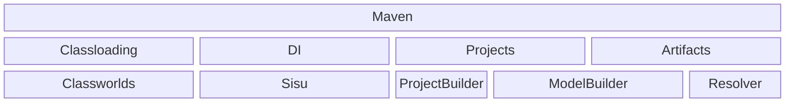

Here am trying to explain what is [Maveniverse/MIMA](https://github.com/maveniverse/mima), but also to explain 
what it is not.

There is Maven, as we know it, and there are libraries that Maven uses to be "Maven as we know it", like 
[Resolver](https://github.com/apache/maven-resolver) is. Many times, use case requires use of "Resolver only"
without all the fuss and fluff of Maven. Historically, there was the `ServiceLocator`, that made Resolver 
**somewhat reusable** outside of Maven, but then [MRESOLVER-157](https://issues.apache.org/jira/browse/MRESOLVER-157)
came in, so what now?

`ServiceLocator` was conceived in "Plexus DI" times, and implied several shortcomings most importantly
"no constructor injection", so we really had to get rid of it. Also, even if one used it, the "user experience"
was near zero: you still had to solve interpretation of user environment (like `settings.xml`, password encryption, etc).
Basically, everyone had to redo everything, as can be seen from the amount of "copy-paste" code across all the
projects reusing Maven Resolver. Resolver did get a "replacement" for deprecated (and removed in 2.x) `ServiceLocator`
in form of [MRESOLVER-387](https://issues.apache.org/jira/browse/MRESOLVER-387) but just like `ServiceLocator`, 
this one offered same level of "user experience". Same problems existed still.

Moreover, Maven 3.9.x itself (for various reasons) **prevents you from creating "own" (embedded) Resolver instance inside of it**, 
that is, when you run embedded in Maven as a Maven Plugin or Build or Core extension. All Maven versions offered you 
its own Resolver, just inject it!

## (Trying to Re)use Resolver

[Resolver](https://github.com/apache/maven-resolver) itself may look like a respectable code base, but it is
**incomplete**. Resolver was envisioned as "generic" and "reusable", hence Resolver itself does not
contain any traces of "models", as in reading "metadata", discovering "versions" and so on. In fact, to make
Resolver complete, you must implement several components of it, that are not implemented in Resolver itself.
Resolver alone is incomplete even at object graph level (lacking implementations). To "complete" Resolver, Maven implements the missing components
in [`maven-resolver-provider`](https://github.com/apache/maven/tree/maven-3.9.x/maven-resolver-provider/)
subproject, but alas, this subproject depends on [`maven-model-builder`](https://github.com/apache/maven/tree/maven-3.9.x/maven-model-builder)
subproject, as one can expect, Resolver to interpret POMs, needs fully built (and profile activated) models,
**even if Resolver itself never even touches POMs/Maven Models**. Resolver have no idea about the syntax nor the
real contents of Maven POM.

Maven **roughly, very roughly** looks like this, where "Artifacts" block should be more like "Artifact Collection, 
Resolution, Transport (and more)".



Again, **roughly** the "Classloading" deals with classpath isolations of Maven Core, Extensions, Plugins and Projects, 
for more [see here](http://takari.io/book/91-maven-classloading.html). The "DI" block is dealing with Dependency
Injection. The "Projects" deals with "your POMs", and building (or whatever you do) of them. Finally, the "Artifacts"
block deals with, well, "Artifacts" (external ones but also yours as well, once built, like installing or deploying them). 
Maveniverse MIMA covers the lower right side of this diagram, basically the "Artifacts" only. Do notice though, 
that "ModelBuilder" is **shared** between "Projects" and "Artifacts".

The "MIni MAven" project was conceived when I realized how all the existing solutions to "reuse Maven Resolver" were
incomplete, or "non-aligned" at least. When I went over some of the most notable users of
Resolver, like [JBoss Shrinkwrap Resolver](https://github.com/shrinkwrap/resolver), 
[Ops4J Pax URL](https://github.com/ops4j/org.ops4j.pax.url) and 
[JBang](https://github.com/jbangdev/jbang) (just to mention some of the major ones) and to figure out that same code, 
even if not dully copied and pasted, but clearly the intent was very the same, is repeated over and over again, 
with all of their own bugs, shortcomings, "not yet implemented" and everything as one can expect.

## MiB

Goals of MIMA are following:
* offer access to Resolver APIs (as [defined here](https://maven.apache.org/resolver/api-compatibility.html)) wherever you are
* step in instead of Maven if Maven is not "present", basically offer you "user environment" as Maven would create,
  like honor user `settings.xml`, decrypt passwords if needed, etc. 

In general, MIMA wants to be more like "Man in Black", present but not seen (am alluding to movie if anyone have any doubts), 
but instead of aliens, it deals with providing you "full Resolver experience" whether you run "embedded in Maven" 
(ie Maven Plugin or Extension) or "standalone" (outside of Maven).

MIMA allows you to code like this:

```java
        ContextOverrides overrides = ContextOverrides.create().build();
        try (Context context = Runtimes.INSTANCE.getRuntime().create(overrides)) {
            
        ... use ResolverSystem and ResolverSystemSession from Context
        
        }
```

It basically offers you pretty much the same experience whether you run "embedded" in Maven or "standalone" in CLI.
MIMA merely tries to "hide" from you from where `RepositorySystem` and `RepositorySystemSession` comes from. From Maven?
Or did MIMA just create one for you? Don't care about it.

In any case, it allows unfettered access to Resolver APIs. Also, important to mention, MIMA offers Resolver access "up to `maven-core`".

That above means a difference as well: for example packaging plugins **are not injected** when using MIMA in standalone 
mode (as that part of Model Builder is done by components that reside in `maven-core`). But again, MIMA offers 
Resolver APIs, that is **about _Artifacts_ and not about _building of theirs_**. If you want building, use Maven.

Despite the name, **MIMA is not Maven**, is just a piece of it.

## MIMA and Maven 4

About Maven 4, MIMA and the future, we still have to see how things fit together. But just to drive your fantasies, here
are listed few possibilities:
* We have Resolver 1.x and Resolver 2.x (that are pretty much [binary compatible](https://maven.apache.org/resolver/upgrading-resolver.html))
* We have Maven 3.x and Maven 4.x, they use Resolver 1.x and Resolver 2.x respectively.
* Wild combos are [possible](https://github.com/maveniverse/mima/issues/65), such as
  * Resolver 1.x + Maven 3 `maven-resolver-provider` (and deps) => **this is MIMA 2.x**
  * Resolver 2.x + Maven 3 `maven-resolver-provider` (and deps, thanks to binary compatibility) => Theoretically could work, but who would need this?
  * Resolver 2.x + Maven 4 => This [may be **MIMA 3.x**](https://github.com/maveniverse/mima/pull/28)
  * **BUT** Maven 4 API "hides" Resolver completely, and is also able to work "standalone", and am really unsure do we need MIMA at all?
