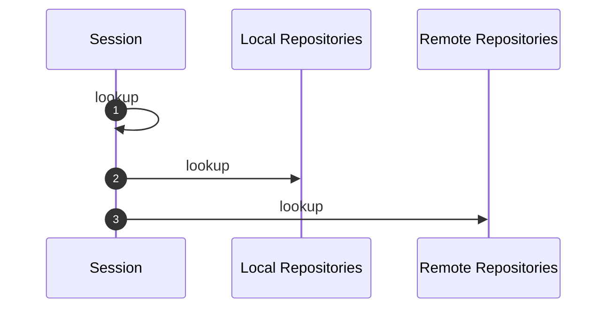

{}

This article assumes reader has basic knowledge about Maven, POM and related things. The main point is to offer high
level conceptualization and explain things "why's" and "why not", and finally explain why you don't want to listen to
folks that tells you "never do..." (unless they are your parents).

{}

## The pieces

In Maven you will read about following very important things:
* **session** (historically called "reactor" by a Maven 2 plugin) - the set of subprojects Maven is working on
* **project** (sometimes called "checkout", referring that project is checked out from some SCM) - the set of subprojects that makes the "project" you are working on
* **local repositories** (since Maven 3.9 you can have multiple of these; in a limited way) - the mish-mash directory, where Maven caches (remote) and installs (locally built) artifacts
* **remote repositories** - remote repositories that contains deployed artifact meant to be shared. Most notable one being Maven Central provided "out of the box". Most often they are reached via HTTPS.

{}

While the concepts are similar, if not same, there may me slight deviations between open source (globally
available) and "corporate" (could not come up with better name) scenarios, where some company provides infrastructure
(like remote repositories, caches, but also some sort of "confined" network as well).

{}

Let's start from end.

### Remote repositories

This one is I think simplest, and also the oldest concept in Maven: Maven will get you all dependencies you need to 
build the project, like the ones you specified in POM. And to do so, Maven needs to know all remote repositories 
where required artifacts reside. In "ideal" situation, you don't need to do anything: all your dependencies will be 
found on Maven Central.

{}

Have to note that "dependencies you need" are **not only dependencies you specified in POM**! Maven itself
performs builds using **plugins**, and you guessed, those are also JAR artifacts, fetched from remote repositories.
Hence, remote repositories should be declared for all artifacts your build needs.

{}

By default, Maven will go over remote repositories "in defined order" (see effective POM what that order is) in a 
"ordered" (from first to last) fashion to get an artifact. This has several consequences: you usually want most often
used repository as first, and to get artifacts from last repository, you will need to wait for "not found" from all
repositories before it. The solution for first problem is most probably solved by Maven itself, having Maven Central
defined as first repository (but you can redefine this order). The solution to last problem (and many more!) is offered as 
[Remote Repository Filtering](https://maven.apache.org/resolver/remote-repository-filtering.html).

From time to time, it is warmly recommended (or to do this on a CI) to have a build "from the scratch", like a fresh
checkout in a new environment, with empty local repositories. This usually immediately shows issues about artifact availability.
Nothing special needed here, usually is enough just to use `-Dmaven.repo.local=some/alt/loca/repo` to achieve this.

Also, from this above follows why **Maven Repository Manager (MRM) group/virtual repositories are inherently bad thing**:
By using them, Maven completely loses concept of "artifact origin", and origin knowledge is shifted to MRM.
This may be not a problem for project being built exclusively in controlled environments (where MRM is always available),
but in general is very bad practice: In such environment if Maven users and MRM admins become disconnected, or just
a simple configuration mishap happens (by adding some new repository to a group) problems can arise: from suddenly much more artifacts becoming available
to Maven through these "super repositories" to complete build halt. And worse, Maven builds like these are not portable, as they have a split-brain situation:
to be able to build such a project, Maven alone is not enough! One need to provide very same "super repository" as 
well. It is much better to declare remote repositories in POM, and have them "mirrored" (one by one) in
company-wide `settings.xml`, instead to do it opposite: where one have "Uber Repository" set as `mirrorOf: *` and points
it to a "super repository". In former case Maven **still can build** project if taken out of MRM environment (assuming all
POM specified repositories are accessible repositories), while in latter case, build is doomed to simply fail when
no custom `settings.xml` and no MRM present. Ideally, a Maven build **is portable**, and if one uses group/virtual
repositories, you not only lose Maven origin awareness, but also portability. Hence, in case of using "super groups",
**MRM becomes Single Point of Failure**, as if you loose MRM due any reason, all your builds are doomed to be halted/fail, 
for as long MRM is not recovered and not set up in very same way as it was before. You are always in better situation, 
if you have a "B plan" that works, especially if having one is really "cheap" (technically).

Remote repositories are by nature "global", but the meaning of "global" may mean different thing in open source and
"corporate" environments.

Remote repositories contains **deployed** artifacts meant to be shared with other projects.

### Local repositories

Maven always had "local repository": a local directory where Maven caches remotely fetched artifacts and installs locally
built artifacts. It is obvious, that local repository is a "mixed bag", and this must be considered when setting up
caching on CI. Most of the time you want cached artifacts only, not the installed ones.

Since Maven 3.0, local repository caching was enhanced by "origin tracking", to help you keep your sanity with 
"works for me" like issues. Cached artifacts are tracked by "origin" (remote repository ID), and unlike in Maven 2, 
where artifact (file) presence automatically meant "is available", in Maven 3.0+ it is "available" **only** if artifact
(file) is present, **and** origin remote repository (from where it was cached) is contained in caller context provided 
remote repositories.

Since Maven 3.9 users may specify multiple local repositories as a list of directories, where HEAD of the list is the 
local repository in its classic sense: HEAD receives newly cached and installed artifacts, while TAIL 
(list second and remaining directories) are used only for lookups, are used in read-only manner. This comes handy in 
some more complex CI or testing setups.

{}

You are not married to your local repository! In other words, it is "best practice" if not downright
real lifesaver to completely delete your local repository from time to time (ie. weekly). In Maven 2 times, it became
a (bad) habit to "stick to your local repository" as it was really just a "bunch of files" laid out in some way.
But, since Maven 3.0 doing this is wrong: the "origin tracking", while is done with good intents (compare to
"road to hell"), is not flawless and has issues. Also, many things, like renaming a subproject or alike can cause
headache, that can be easily solved (and spotted!) just by nuking your local repository.
Unless, **you can use "split local repository"**... read more on that below.

{}

Since Maven 3.9 users may opt to use "split local repository" that solves most of the above-mentioned issues, and allows one to
selectively delete accumulated artifacts: yes, you do want to delete installed and remotely cached snapshots from time to time.
Luckily, "split local repository" keeps things in separated directories, and one can easily choose what to delete. 
But all this comes at a price: "split local repository" is not quite compatible with all the stuff present in
(mostly legacy) bits of Maven 3 universe. Using "split local repository" is **warmly recommended, if possible**.
If you cannot use it, you should follow advice from previous paragraphs, and nuke your local
repository regularly, unless you want to face "works for me" (or the opposite) conflicts with CI or colleagues.

Local repositories are, as name suggests "local" to host (workstation or CI) that runs Maven, and is usually on 
OS local filesystem.

Local repositories contains **cached** artifacts pulled from remote repositories, and **installed** artifacts
that were built locally (on the host). You can also `install-file` if you need an artifact present in local repository.
Split local repositories keeps artifacts physically separated, while the default one keeps them mixed, all together.

### Project

Projects are usually versioned in some SCM and usually contain one or more subprojects, that again contain **sources** 
that when built, will end up as **artifacts**. So, unlike above, in remote and local repositories, here, we as starting 
point have no artifacts. Artifacts are materialized during build.

Still, inter-project dependencies are expressed in very same manner as dependencies coming from remote repositories.
And given they are "materialized during build", this has severe implications that sometimes offers surprises as well.

### Session

The session contains projects that Maven effectively builds: usually or most commonly is same as "Project" above, 
unless some "limiting" options are used like `-r`, `-rf` or `-N` and alike. It is important to keep this (not obvious)
distinction, as even if checkout of the project contains certain module, if that module is not part of the Session,
Maven treats it as "external" (to the session). Or in other words, even if "thing is on my disk" (checked out), Maven
if told so, will treat it as external artifact (not part of Session).

## The pieces together

How does Maven finds artifacts? Maven building may be envisioned as "onion" like structure, where search is performed 
from "inside to out" direction. Each [artifact coordinate](https://maven.apache.org/repositories/artifacts.html) (GAV, 
that is "artifact coordinates" and has more elements than 3, but for brevity we consistently use
"GAV" to denote artifact coordinates) is looked up in this order:



In short, when Maven is looking up some artifact, it will start in session, if not found then in local repositories, and finally
if still not found it will try to get it from remote repositories. Each "actor" except for Session may deal (and usually is) with multiple 
actual repositories. As mentioned above, Local Repositories may be a list of directories (lookup with iterate thru all of them in
list order), and Remote Repositories also may contain several remote repository definitions as well. But in "most basic" case, user
have one local repository and Maven Central as remote repository.

When we say **artifact is resolvable**, we mean that required artifact can be retrieved by one of the `lookup` calls.
If a required artifact is non-resolvable, build failure is the expected outcome.

Also, as can be seen, "limited Maven sessions" (when you narrow subprojects being built by any means) still must
have existing inter-subproject dependencies resolvable. Given you are narrowing the session, you must make sure this is fulfilled
as well. Easiest way to do it is by `install`ing, as then locally built artifacts becomes available across multiple sessions
(Maven CLI invocations) by being present in Local Repositories. This does not pose any problem when rebuilding, as you 
can see in call diagram, artifact if present in both places, in this example in Session and Local Repositories, 
Session is asked first ("wins" over right hand ones).

### When to install?

You do want to install, to keep things simple. People advising "do not install!" usually justify their decision by
some colloquial "beliefs" like "I don't want to pollute my local repository". That justification is a red herring as can be seen
above: this implies that these people **are married to their local repositories**. They insist on keeping "pristine" something
that is part of "planned maintenance". This justification is just wrong, or, it may reflect those users confusion what
Local Repositories are about. Local repositories are almost the same the part of project(s) you are working on, like 
checkouts. They are "within your work context", not outside.

{}

One of the praised new Maven 4 feature is `-r` resumption option, that makes you able that in case of, for example, Unit
Test failure, "fix the UT and continue from where you failed", and it works without invoking `install`. Well, the truth
is that this is achieved by adding a new Maven 4 feature: project wide local repository (as opposed to user wide
local repository, as known in Maven 3). The praised feature works, in a way that Maven do installs after all, even if 
you did not tell it to do so. So what gives?

Of course, this is not critique of a new, and a really handy feature, am just explaining what happens "behind the curtains".

{}

Moral of the story: you don't want to keep your local repository pristine, you do want to make it "dirty" instead. 
"Polluting" (for me is funny even to think
of this word, is like projects I work on are toxic) your Local Repository with 
artifacts from Project(s) you work on is part of normal workflow and process. And Maven 4 installs (true, not into 
local repository, but does it matter?) even if you don't tell it to do so. Hence, you can calmly do the same thing 
while using Maven 3 and just following the "best practices" explained here and elsewhere. Again, flushing caches is part 
of planned maintenance.

Installing is also needed, in case you work on a chain of projects, that depend on each other. And example can be Maven
and Resolver: if there is a bug, that needs Resolver code changes, there is no other ways than installing one and 
building another, that picks up fixed and installed artifacts from Local Repositories (to be honest, there are, but you 
don't want to do what my fencing teacher told: "reach your left hand pocket with your right hand"... well, you can, but 
why would you?).

Ultimately, it is up to developer (the Maven user, but same stands for CI script as well) that needs to be "aware", and 
just make sure that build works and produces what it needs to produce, of course by proper uses of caches and proxies to
not bash publicly available Remote Repositories. If "by chance" a year-old installed SNAPSHOT ends up in your build, you have more
problems as well; it just means you lack some healthy maintenance routine. No magic nor any kind of "silver bullet" 
will do this for you.

But as can be seen, depending on what you do, the "resolvable artifacts" should be resolvable. Hence, the simplest
thing to do is always to "level up" them: from Session to Local Repositories by installing them (making them resolvable 
workstation-wide) or, deploying them to Remote Repositories (making them resolvable globally, if needed). Again, it all
depends on what you do.

### Snapshots

Snapshot Artifacts are yet another not well understood kind of artifacts, but now will mention them only in context
of this blog. Best practice with them is to not let them "cross organizational boundaries". Or in other words, within 
a company, one team is okay to consume snapshots of other team (boundary is "within a company") assuming regular snapshot deployment
is solved. Same stands for example for Apache Maven project: Maven depending on snapshot Resolver is okay (and even happens from
time to time), given both are authored by us. In short, consumer should be able to influence the publishing of snapshots. You should never depend on
snapshot that is outside your "circle of boundary", which is hard to precisely define, but the smaller the circle is,
the better.

On the other hand, when Maven does depend on snapshot Resolver, anyone building it will pull a snapshot artifacts and cache
them to their local repository. And here is the thing: once, in the future, that codebase will get released and deployed
to some remote repository (Resolver to Maven Central).

So what happens to that snapshot in your local repository? By default, nothing, but if you consider "server side" of
things, MRM used by Apache foundation will clean it up, once released. This even more increases your "disconnect" from
the reality: you have something cached that does not exist anymore.

Hence, snapshots are yet another reason why you want to nuke your local repository. They are not inherently bad either,
but they do need some extra caution.

## Practical examples

Below are some personal advices; you don't have to do these like it, my idea is just to give some advices and explain 
why they matter.

For start, keep your OS and tools up to date. That stands for Java, SCM like `git` tools and of course for Maven as well. 
There are many "meta" tools to maintain up-to-date developer tools on workstations, just make use of them.

For start, as many of us, I tend to work on my "daily job" projects (paid job) but also on "open source" stuff, many 
times hopping from one to another. For start, I keep these environments separate, as best practice (but also by a must, 
as paid job requires MRM access via dead slow VPN. Still, even if no VPN needed, I'd still keep the two separate). 
This means I have two `settings-XXX.xml` and two Local Repositories (none in default location). The Maven settings `~/.m2/settings.xml` file
is just a symlink to the one in use, to the "real" I work in: "work" or "oss". Keeping unrelated things separated (compare
this to "keep ONE thing pristine/un-polluted") is best practice.

An interesting side effect of this setup is that it is dead simple to detect some Maven or Plugin bug: if "default local repository"
appears, I immediately know there is something in the build that does not play by the rules.

Next step assumes use of proper caches. You (and your CI jobs) do use them, right? I use [Mímir](https://github.com/maveniverse/mimir)
on all my workstations (as user-wide extension, as I use mainly Maven 4 to develop). On the other hand, many of
projects I build are "not yet ready" for things like Split Local Repository, hence I just nuke my local repository
weekly or bi-weekly. Monday morning usually starts with nuking them (&#x1F91E;).

I tend to *project hop a lot*, as I usually not work only on Apache Maven projects, but my PRs span from Quarkus, JBang,
and Netty all over to Maveniverse, and all of those are built (and installed) on almost all of my workstations I hop from and to.

In further text, I will discuss my "oss" routines.

### Morning Routine

I tend to work on forked repositories using `git`, and remotes are usually called `origin` (my fork) and `upstream` (the
forked upstream repository). To pick up possible changes, what I do is (assuming I am on default branch, otherwise assume
`git checkout master`):

```
$ git fetch -p               # fetches my fork; showing newly-created + updated + dropped branches; as I workstation-hop
$ git branch -D dropped      # (optional; perform local cleanup of gone branches)
$ git fetch upstream -p      # fetch upstream; same thing
$ git rebase upstream/master # (optional) pick up changes if any
$ git push origin main       # (optional) if above happened, push changes to my fork for sync reasons
```

I repeat these steps as very first thing on projects I plan to work on (for example Maven and Resolver). This makes sure
my local environment is synced with all the rest of teammates. If you are about to continue to work on a feature branch,
this these steps above shall be repeated with feature branch, potentially (YMMV) merging in upstream master changes and
pushing it to your fork and so on. Again, I do this as I do workstation-hop a lot, and my fork may contains changes
I do on other workstation.

```
$ git clean -nfdx            # local checkout cleanup; for example after Guillaume reshuffles modules in project
```

This command is "dry run" (due `-n`), but is handy to show how "dirty" your checkout is compared to git tracked
files and directories. If you actually need cleanup, remove the `-n` and invoke it.

### Quick-build projects

This is like morning routine, and many times a must, when you work on several (inter dependant) projects. In fact, many
"real world" projects (Camel, Quarkus) offer some sort of "quick build" possibilities. As we all know `-DskipTests` is
bad thing, so what I do is usually:

```
$ mvn clean install -Dtest=void -Dsurefire.failIfNoSpecifiedTests=false
```

This is my "quick build" for Maven and Resolver (and all the other Apache Maven projects). A remark: our "work" project
has this configured by default on Surefire plugin, so just `-Dtest=void` (or any string that does not match test) is needed.

This way I know my local repository is "primed" (or populated on Mondays).

From this moment, one can open IDE or whatever and begin working on project. From here, if you work on single project,
you can continue issuing `mvn verify` or whatever you want.

### Changing branches

Again, this depends on what you do: if you change to some feature branch that is "close to" master, no cleanup needed
but "quick build" is advised. In "big change" cases (compare Maven [maven-3.9.x](https://github.com/apache/maven/tree/maven-3.9.x) and 
[master](https://github.com/apache/maven/tree/master) branches!), a full `git` cleanup and "quick build" is advised.

If you are lucky, and you are able to use split local repository, you can find more tips under ["Use Cases"](https://maven.apache.org/resolver/local-repository.html#Use_Cases).

### Warm up with your project

Doing these "routines" should not take longer than having your first cup of coffee, while just like coffee does for you,
it "warms up" Maven environment for real work. Of course, nothing is black or white: the mentioned projects like Camel
and Quarkus may "quick build" for 20-30 minutes as well. In those cases, you will probably consider some other techniques
like [Maven Build Cache](https://maven.apache.org/extensions/maven-build-cache-extension/) and others.
 
I am lucky to spend my time on "small scale" projects like Maven and Resolver are.

## Conclusion

No, `mvn clean install` is not "pure evil", it has its own merit. And no, installing built artifacts is not "polluting",
that is really silly thing to say. And finally, if your build picks up a year ago installed SNAPSHOT from your local
repository, you are simply lacking proper and planned maintenance. Snapshot cleanups is what usually modern MRMs do 
on scheduled basis, same should happen to your local repository. Don't feel pressured to submit yourself to "facts" 
that are more like "beliefs", and as such, are usually wrong. That said, it is much better to get accustomed and learn 
what and how your tools do, instead to become a blind "cult follower".

Join to [Maven Users](https://maven.apache.org/mailing-lists.html) list and feel free to ask!