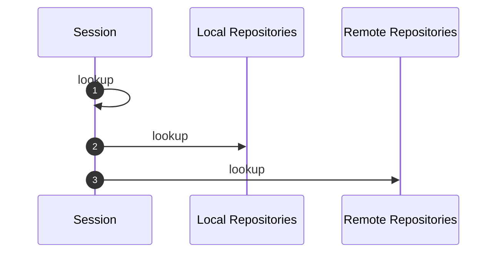
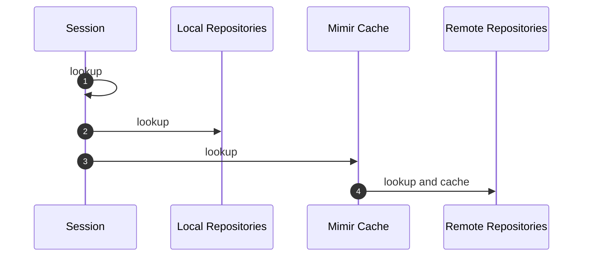

Just to remind people about Mimir, and why they want to use it: if you remember the [Never Say Never](/blog/2025/03/17/never-say-never) blog entry
diagram:

With Mimir on board, it changes to this:

This means, that **nuking local repository** is not an impediment anymore, as you still have everything in your
Mimir cache, and building is as fast as with populated local repository.
