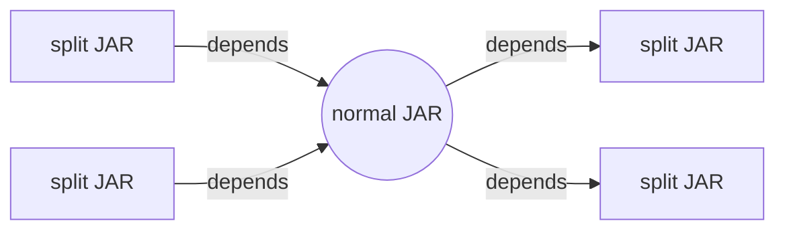

{}

This blog entry was done as a response to [Pom-Pom-Pom](https://www.liutikas.net/2025/06/12/Pom-Pom-Pom.html).
Note: this entry does not want to be hurting, personal or anything like that; still my native language is not
english, so bear with me (and feel free to create updates to it).

**Note: I talk (and reason) about Java and JARs in general, and not about C or any other language than Java.**

You may want to check out [part 1](/blog/2025/07/02/pom-proliferation-part-1).

{}

## Where to continue?

Let's clear up the wrong assumptions first, quickly:
* we talk about consuming artifacts, as Maven -- and this is very often re-occurring misconception -- ignores `project.packaging` while consuming. That POM field is used **only during build**.
* Maven artifacts coordinates are [explained here](https://maven.apache.org/repositories/artifacts.html)
* Maven user declares what and how (coordinates + type) should he use a dependency
* for platform native dependencies check out projects like [Netty](https://netty.io/) or [JavaFX](https://openjfx.io/) (and many others), as they all managed to handle it (to work for Maven consumers).

So, let's talk about single artifact: what it is, really? And how many "variants" they may have? In cited blog they
have the following examples:
* debug vs release versions (AFAIK, debug on modern Java is no-op, but okay)
* compile vs runtime versions -- are you sure we talk about **single artifact** in this case?
* per-CPU architecture versions -- see "native" examples above
* JVM target versions (Java 8 vs Java 21) -- Like Bouncy Castle? But again, are you sure we talk about **single artifact** in this case?
* JVM vs Android compatible -- like Guava is on Central?

But, as a slight digression, let's look around in other universes, what they do. Given an artifact is "unique within
a repository", the use of different repositories sounds a way to go. In fact, many GNU/Linux distros does so, they usually have 
separate dedicated "debug" repositories, for debug packages. This aspect is many times simply forgotten, as people
tend to focus on Maven Central.

The debug vs release is quite typical use case, but IMHO, all these "issues" are some variation of red herring: 
For example the sentence "All the approaches above require flattening the resolution of the dependencies, namely every 
library dependency that is added requires to match the splits of every other dependency" assume you expect to have some
transition in dependency graph like this:

But this example is IMHO non-existing: why would a "normal JAR" require some "split JAR" (for example, split by "JVM vs Android") 
on its own? As IMHO a "normal JAR" may depend only on some other "normal JAR". Moreover, it is insane to expect from 
"normal JAR" to **enumerate ahead of time** (at his own publishing time) what all "splits" may exist at the time
when it is being consumed by you and anyone else. Hence, this is **your job**: the right-hand "split JAR" selection for 
"normal JAR" is your job, not "normal JAR" dependency's publisher job (that may have published the JAR 20 years ago and since
then changed careers and opened a pub). You are the one putting the "normal JAR" in your context, not the "normal JAR" publisher,
moreover, the publisher of "normal JAR" may be very well even unaware of "split" you need/want/have. All this story
is just silly.

I mentioned the example of Guava for the "JVM vs Android" case, but it works as it is "leaf dependency", the problems 
 described by author does not exist with leafs. But the fact that author clearly thinks, and writes about 
"non leaf dependencies", that hops between from "split JAR" dependencies to "normal JARs" and then back to split, 
just proves my point.

This makes me think, that we (or author of cited blog?) speak about some sort of "full stack", or "product", and for 
my taste, there is no place for those things in a "single repository", especially not in Maven Central.
Companies providing such artifacts should provide their own repositories for these things, like some of them already do.
The existence of Maven Central does not imply that you **must publish there**.
And at the moment realization happens, the "urge" to publish whatever to Maven Central is gone, these issues clears
up as well.

## What is Maven artifact?

For the sake of correctness, lets quickly revisit Maven Artifacts.

As the cited blog correctly wrote, a Maven artifact:
* has one POM (if missing, you lose all dependencies of it, Maven will be grumpy about it, and will WARN on console, but, if binary is is asked and is present, will continue)
* may have one main artifact (or not, build time defined packaging dependent)
* may have multiple "classifier" distinguished artifacts

They key is that whichever "classifier" you use (and main artifact can be seen also as classifier, a "does not have classifier" 
classifier), that _same POM is used to get dependencies_. Hence, my question above "are you sure we talk about **single artifact**"
related exactly to this: if _same artifact_ in different contexts requires (wildly) different dependencies, then
we deal with something else.

And this is how publisher sees it. But how does consumer see it? That's the point. Publishing and consuming are two
distinct flows and (usually) may happen in very distant time as well. Usually
* publisher tells what it builds (is past for consumer)
* consumer tells how it consumes (is future for publisher)

So, the "causality" link between the two, while may exist, it is usually absent, or is "short term" (ie today I know about Java 25,
but I have no idea what Java 35 will contain). It is usually best to avoid "predictions" like these (as user using my library on Java 35 will
know better anyway). So whatever extra info is needed, the "lifespan" (and maybe even meaning of it) can be questioned,
as nobody can predict the future. And Maven Central stores artifacts forever.

These "extra infos" (I require..., I work with...) **may work**, but IMHO only within boundaries of one forge.

Related:
* https://en.wikipedia.org/wiki/Law_of_the_instrument