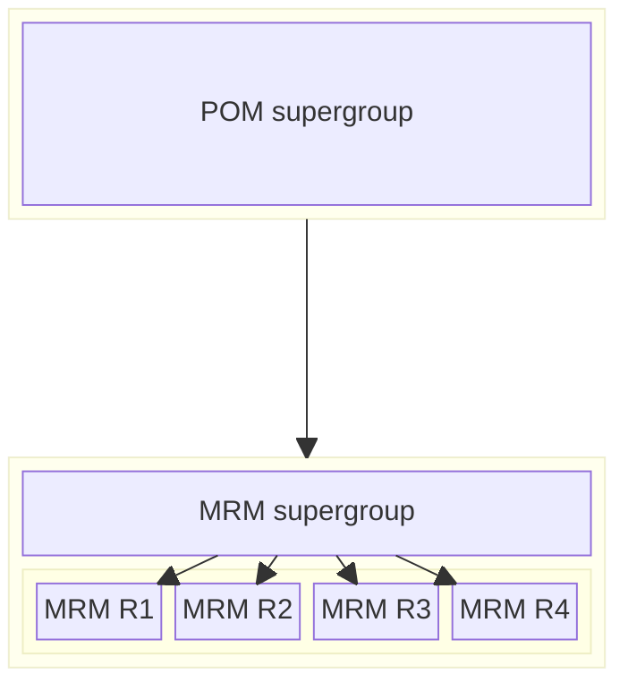
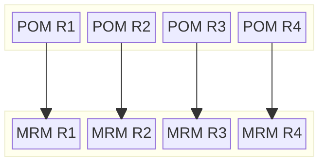

{}

The notion of "group repository" was introduced by first Maven Repository Manager-like solution (then called "caching proxy", today simply MRM): 
Proximity, [announced on Maven devlist in 2005](https://lists.apache.org/thread/vp9ghlncvvnozcs3mqh9ghsmmrksyoh5). Since
then, almost all major MRM implementations implemented it. Some called it "group repository", others "virtual repository",
but the fundamental idea remained the same: publish (and aggregate) multiple repositories over same URL. For brevity’s
sake, I will use the term "group repository" (GR) along with "hosted repository" (HR) and "proxy repository" (PR), while
some solutions out there may use slightly different (but fundamentally equivalent) terms.

Since then, I issued an [apology too](https://cstamas.org/blog/2025/01/almost-20-years-of-mrms/).

{}

## The Promise

The original incentive of group repositories was to simplify things, they offered a way to publish one single
"entrypoint" (URL) to be used by Maven as a remote repository, that in fact was backed by aggregation of multiple 
other (hosted, proxy and sometimes even group) repositories on same MRM. 
That one single entry point is usually set up to "have it all", that client or clients (Maven builds) require. 
Multiple strategies exists out there how to set up groups, and most, if not all of them, are flawed.

The promise was simple: Less XML. That's it, really. With groups, your POM needs to enlist one "supergroup", and you are done. That "supergroup"
has it all you need, or want, or in some cases, you are allowed to get. They also promised "faster build", as most often
the CI where build ran, was "close to" (networking wise) to MRM instance, and MRM instance provided all for the build:
hosted and cached/proxied artifact, along with the aggregation via single entry URL.

{}

Note: the term "faster build" here will be used in strictly in relation to "faster build with regard to transport", or in
other way, builds that happen with empty local repository, hence, they need to get everything from remote.

{}

## The Reality

Initially, it looked good, very good. POMs were really simpler, and builds were faster. But on longer term, the problems
started to show.

For start, builds became **non-transportable**: the build works only within that one single environment. This is mostly
fine for closed source company developed projects, but totally unacceptable for fully open (or open core) projects, where
CI may have to be duplicated on outside of forge boundaries, thing like public CI instances. But even for
closed source project there are many pitfalls.

The consequence is that **project configuration** is maybe just blurred, but sometimes fully delegated from Maven to MRM: Maven is not anymore in control,
but neither is MRM. Building becomes impossible at the moment Maven cannot reach MRM, or, and this is the more usual
case, MRM **changes** intentionally or unintentionally. It may be migrated, upgraded or even just reconfigured. The sole
group repository change may render builds inoperable. Also, it is very easy to create "overlap" (see [Local Repositories](/blog/2025/11/09/maven-local-repository/)),
especially with "supergroups". In this very moment, with or without the awareness of this overlap (by MRM maintainers
and MRM clients) your MRM, and thus, client builds became dependent on repository ordering of the group repository. Later,
one build may fail and other may work if you make your `GR` as `(R1, R2, R3)` while the opposite happens only if you
reorder it as `(R2, R1, R3)` and so on. And to untangle all this is very hard.

And don't think this is uncommon! Many forges offered their own groups as entry points for public access. 
But by doing so, they inadvertently offered "alternative" Central and many other repository (proxied by themselves) access too.

But it gets even worse: Maven build has "no idea" about remote, and remote has "no idea" about Maven build. The old mantra about "Maven 
goes round-robin on remote repositories" is false today: In trivial project [RRF Demo](https://github.com/cstamas/rrf-demo)
just the use of RRF (and no other change) **improved the build duration from 2:01 minutes to 0:20 seconds**! Using groups 
puts this "nobody has any idea" into cement, as no party can even improve things: Maven has no idea how to route smarter,
while MRM has no idea what client really wants ("what is the build context"). In fact, what happens, is that the **old
mantra of "Maven goes round-robin over remote repositories" is just shifted to "MRM goes round-robin over group member
repositories"**, it takes away any possibility to improve. There may be some optimizations in place in some MRMs, 
but MRM still has no clue about overall picture: all it can work off is just one HTTP request for given artifact.

By forcing Maven to go over the group repository, clients also lose any extra information, like prefixes, indexes and
any possible future metadata published for certain repositories (see [Remote Repository Filtering](https://maven.apache.org/resolver/remote-repository-filtering.html)).
Or, sometimes they may serve the resource, but the **wrong one**. Users of such MRMs are really only able to shut down RRF
and not even thinking about using it, again, due MRM groups. And go back to plain old "round-robin" hoping the best.

And the worst part: Maven completely loses provenance information, everything is "lumped together". Maven cannot 
distinguish what comes from where for real. This information is just taken away from it.
This way all the possible helping hand of Maven is taken away as well, only to
become "fully reliant" (and dependent) on MRM. Thus, creating things like SBOMs or some reporting may become a challenge. Usually people
just give up, agree to lose all the Maven side (usually open source) solutions, and replace them with proprietary one.

## How to MRM

For start, for sure you use Central. You most probably [want to keep it first](/blog/2025/06/12/keep-central-first/) in your list (there are **rare** 
circumstances where you may choose not to). Next, you should declare all your repository to represent "truth" (similar
like is the case with Njord and regarding publishing repositories). Essentially, all your repositories aside of Central
(is given) should be enlisted in your POM.

Instead of this:

You want this:

Next, you want environment specific settings, that will properly "redirect" the defined repositories telling "the truth",
to those URLs your environment provide (ie. Central proxy).

## When to use groups?

Group repositories are still useful, but are not silver bullet. They are fine to be used to group repositories that are
logically bound together, like for example you can "stripe" your snapshots into `snapshots-2024`, `snapshots-2025` etc
and you could group them into `snapshots` group repository. Some MRMs have this feature to allow deploy operations
against group URLs, where the deployment ends up in first repository (presumably `snapshots-2025`). But cannot 
stress enough: grouped repositories should have same (or similar) contents, like in this example: assumption is that 
your forge deploys to `snapshots`, hence it contains your artifacts only, and not some external ones.

