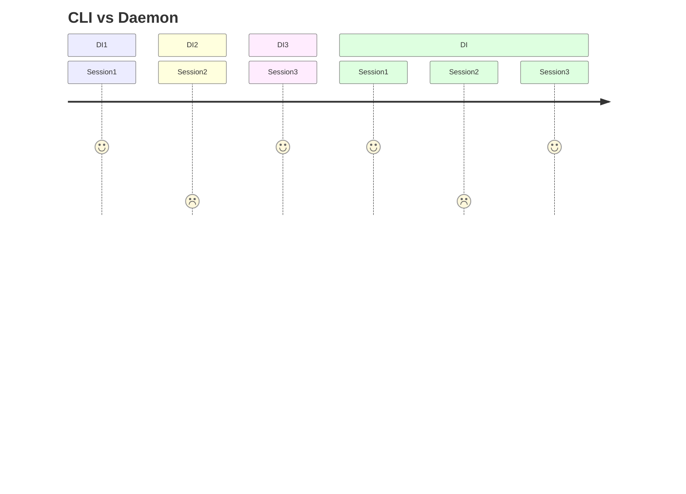

{}

Maven internals uses dependency injection (DI) since it's inception in 2002 (that is, since Maven 2, if we don't count 
Maven 1). And historically it used Plexus Container for DI, while today it uses Eclipse Sisu that also provides
Plexus "shim", a re-implementation of Plexus DI API (but implementation was changes totally from custom Plexus Container
to Sisu that relies on Guice).

{}

Component scopes in Maven can be tricky. In an ideal case, a component is stateless, and is usually **a singleton**.

Maven offers 3 scopes for components:
* singleton - created by DI container lazily if is "just" `@Singleton`, or eagerly, if marked with [@EagerSingleton](https://eclipse.dev/sisu/apidocs/org/eclipse/sisu/EagerSingleton.html). But in any case, once it was created, DI will hold on created instance, and whenever it was asked for injection, same instance will be injected.
* session-scoped - Maven creates session (`MavenSession` type) before project is being processed, and this session ends once "build ends" (by whatever outcome). Session scoped components may exist only within the boundaries of Maven session lifespan.
* prototype - new instance of the component is created for every injection request.

While similar, there are notable differences: singleton and prototype components exists while "in Maven" but also
"outside of Maven". Session scoped components can exist **only in Maven** (ie are not usable in apps using MIMA or
in similar use cases, where there is no "full-blown" Maven around the code, nor is Maven Session being created).

Another important difference is their lifespan in relation where are they used:
* Maven CLI - every invocation fires up a Java process, that in turn creates DI container, and within Maven creates Maven Session, does the job, and process exits.
* Maven Daemon (or Eclipse m2e) - here the container is kept alive across several invocations. So same DI instance is reused across several Maven Sessions!

Basically, the difference between CLI and Daemon is that in first case, DI container and Maven Session share almost
same lifecycle, they are created and also destroyed together. But not in Daemon use case: there the DI container is 
kept alive, hence, all singletons are kept alive as well. And when "outside of Maven" case (ie MIMA), there is no Maven session at all.

For example, see below for differences with 3 invocations:

In case of CLI, 3 invocations created 3 Java process, 3 DI containers and 3 Maven sessions. On the other hand, in 
Daemon use case, there was one Java process created (and kept), one DI container created (and kept) and 3 Maven sessions
created, one for each invocation.

If your code runs only and only in Maven (ie you are not reusing it in other scenarios), whether you use singleton or
session-scoped components, it will not make any difference for you. But, if you plan to re-use your code "in Maven" and also "outside
of Maven", then you need to carefully choose, when to use session-scoped. And finally, do not forget that
singleton components share same lifespan as DI container has, which may be surprisingly longer in Daemon case, than you 
saw it in case of Maven CLI.

Today, as Maven Daemon is getting more and more common, you need to consider these slight differences, as it may
surprise you with issues that were not present in CLI use case, for example like [this one](https://github.com/apache/maven-enforcer/issues/929):
cache instance was marked as `@Singleton` and it worked well in Maven CLI (as cache was destroyed by destroyed process),
but caused strange side effect in Daemon; rule ran only once (first time) in Daemon, and from there, it remained inactive,
assuming wrongly "I already ran in my lifespan", while in fact, it did not ran in new session, only in first session.