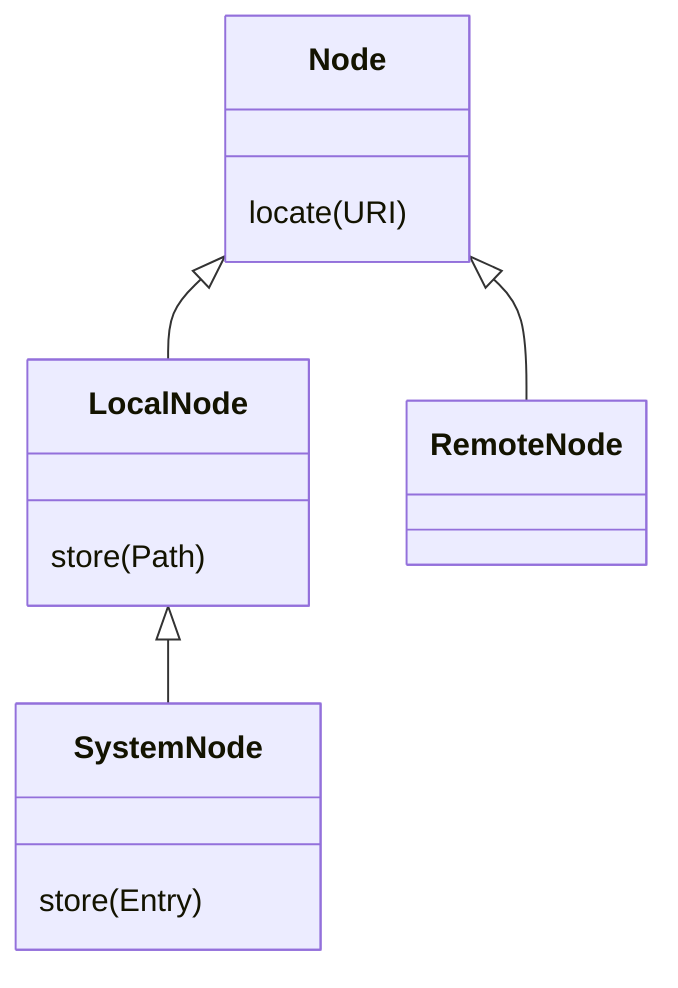

Mímir is a Maven 3 and Maven 4 extension that offers global caching on workstations. More precisely, Mímir is a
Resolver 1.x and 2.x extension (is a [`RepositoryConnector`](https://github.com/apache/maven-resolver/blob/fb6e59027cfce9c9fce6f4e4f6d310c1a7ee906c/maven-resolver-spi/src/main/java/org/eclipse/aether/spi/connector/RepositoryConnector.java)) 
that is loaded via Maven extensions mechanism and extends Resolver.

As you may know, Maven historically uses "local repository" as mixed bag, to store cached artifacts fetched
from remote along with locally build and installed artifacts. Hence, your local repository usually contains
both kind of artifacts.

Mímir alleviates this, by introducing a **new workstation wide read-through cache** (by default in `~/.mimir/local`) and placing
hardlinks in Maven local repository pointing to Mímir cache entries.  This implies several important things:

* you have separated **pure cache** (of immutable artifacts; Mimir handles release artifacts only), unlike existing local repository, that is a mixed bag on your disk.
* because of hardlinks, ideally **you have only one copy of any cached artifact** on your disk (as opposed to as many, as many local repositories you use).
* is **more compatible** than "split local repository" as it is in reality "invisible" for Maven and Maven goals.

Also some consequences are:

* you can easily adhere to "best practices" and delete your local repository often, as you still have it all locally (in Mímir caches). 
  You will not lose you precious time by waiting to populate local repository.
* backup or caching (like in CI case) is simple also: instead of tip-toeing and doing trickery with your local repository,
  just store and restore Mímir caches instead, you may forget local repository.

Advanced features of Mímir is LAN-wide cache sharing, so if you hop from workstation to workstation on same LAN,
you don't need to pull everything again, as your build will get it from the workstation that already has it. Nowadays
with Gigabit LANs combined with modern WiFi networks, doing this is usually faster, than going to Maven Central.

## Architecture

Mimir is composed of multiple components, and works in the following way:

Where node name represents the content "locality": local node is "local" to the user workstation, and hence, has access
to OS filesystem. Remote node on the other hand, need to "retrieve" the content from somewhere else (remote).

## Mimir Session

`MimirSession` (sharing lifecycle with `MavenSession`; lives within Maven process) requires one `LocalNode` and exposes two methods: 
`locate(RemoteRepository, Artifact)` and `store(RemoteRepository, Artifact)` (where `Artifact` must be resolved,
hence backing file set).

Using `MimirSession`, the `MimirConnector`, that wraps original `RepositoryConnector` resolver would use, implements 
caching: it asks `MimirSession` to locate the required artifact. If local node has the artifact, the request is 
"short-circuited and artifact with content is returned to resolver. If not, the `MimirConnector` falls back to original 
connector, and if the artifact is successfully retrieved, it is stored/cached for future use and then returned to caller.

There are multiple `LocalNode` implementations, like `BundleNode`, `OverlayingLocalNode` and `DaemonNode`, but see later for
`SystemNode` implementations, as they **extend** `LocalNode`, hence are usable as local nodes as well!

Out of these, the interesting one is `DaemonNode`: this node in reality starts (unless not already running) a Mímir Daemon
process, and uses Unix Domain Sockets to communicate with it. On workstation, there is only one Mímir Daemon running, and 
it is shared by all builds (`DaemonNodes` in each separate Maven sessions).

## Mimir Daemon

Mímir Daemon requires one `SystemNode` and zero or more `RemoteNode`s. IT implements "round-robin" strategy to locate
the requested artifact: it first tries to locate it in `SystemNode` (which is local to the workstation), and if not found,
it tries to locate it in `RemoteNode`s (which are remote, hence on LAN or WAN). If artifact is found in `RemoteNode`, 
it is retrieved and cached in `SystemNode` for future use.

Mimir Daemon by default uses hard linking, as it runs on same workstation it is used on, and executes commands as
"client" (the `DaemonNode` in Maven process) instructs it.

## Mimir without daemon

In case of CI usage, daemon is usually unwanted overhead, as usually there is **only one Maven process**, hence one "client" of
Mimir cache. In such cases, Mimir can be configured to use other node than `DaemonNode` is. In this case, a `~/.mimir/session.properties`
with content of `mimir.session.localNode=<node name>` can be used, for example `file`.

